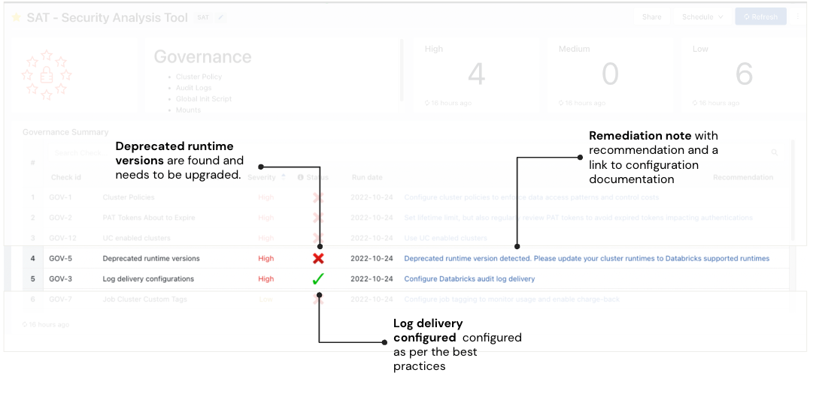

# Security Analysis Tool (SAT) 

## Introduction

Security Analysis Tool (SAT) analyzes customer's Databricks account and workspace security configurations and provides recommendations that help them follow Databrick's security best practices. When a customer runs SAT, it will compare their workspace configurations against a set of security best practices and delivers a report for their Databricks AWS workspace (Azure, GCP coming soon). These checks identify recommendations to harden Databricks configurations, services, and resources.

Databricks has worked with thousands of customers to securely deploy the Databricks platform, with the appropriate security features that meet their architecture requirements. While many organizations deploy security differently, there are guidelines and features that are commonly used by organizations that need a high level of security. This tool checks for typical security features that are deployed by most high-security organizations, and reviews the largest risks and the risks that customers ask about most often. It will then provide a security configuration reference link to Databricks documentation along with a recommendation. 

## Functionality
Security Analysis Tool (SAT) is an observability tool that aims to improve the security hardening of Databricks deployments by making customers aware of deviations from established security best practices by helping customers monitor the security health of Databricks account workspaces easily. There is a need for a master checklist that prioritizes the checks by severity and running this as a routine scan for all the workspaces helps ensure continuous adherence to best practices. This also helps to build confidence to onboard sensitive datasets.

SAT is typically run daily as an automated workflow in the customers account that collects details on various settings via REST APIs. The details of these check results are persisted in Delta tables in customer storage so that trends can be analyzed over time. These results are displayed in a centralized Databricks SQL dashboard and are broadly categorized into five distinct sections for others in the organizationorganizaation to view their respective workspace settings. It also provides links to the latest public documentation on how to configure correctly which helps customers educate on Databricks security in tiny increments feature by feature. Forewarned is Forearmed!. Alerts can be configured on critical checks to provide notifications to concerned stakeholders. It also provides additional details on individual checks that fail so that an admin persona can pinpoint and isolate the issue and remediate it quickly.

## SAT Insights

Data across any of the configured workspaces can be surfaced through a single pane of SQL Dashboard which is the primary consumption layer where all the insights are arranged in well defined categories namely: 
* Network Security,
* Identity & Access, 
* Data Protection, 
* Governance and 
* Informational. 
The data in each section is further categorizedcatgorized by severity namely: High, Medium, Low.

The dashboard is broken into the following sections and each security pillar is laid out in a consistent format 

* Overall Summary
    * The high level summary calls out the distribution counts across all the security pillars further categorized by severity 
* Workspace stats
    * This section provides usage statistics around the number of users, groups, databases, tables, and details around tier, region amongamondg others
* Individual Security Pillars
    * Counts of deviations from recommended best practices by severity (High, Medium, Low)
    * Table of each check in that section detailing the severity and status of the check along with a link to public documentation
* Informational Section
    * These are less prescriptiveprescriiptiive in nature but provides data points that need to be scrutinized by data personas to ensure those are judicious choice of thresholds for the organizatiion, use cases under consideration.
* Additional Details
    * This gives the ability to surface additional information to pipoint the source of the deviation. Example in case of a ‘cluster policy not used’, it may be necessary to provide a list of exact cluster workloads among hundreds where the policy is not applied. This helps prevent a needle in a haystack search situation.

## Detection example

Security Analysis Tool (SAT) does detection of over 37 (we are adding more ) best practice deviations to surface potential risks so that customers can review and improve each configuration. In the following example, the IP Access List check is listed as not configured according to the best practices and remediation with a recommendation, and a direct link to the documentation is provided to make it easy for the customers to take the next steps. The Priave Link check is listed as in-line with the best practices which give confirmation to the customers that they are following the Databricks security best practices.  More importantly, customers can run these checks whenever they wish to get a comprehensive view of the security configuration of their Databricks account workspaces as they make progress with their projects.  

## Configuration and Usage instructions
Refer to [setup guide](./docs/setup.md)  

### Usage
* Attach and Run security_analysis_driver notebook
* Access SAT - Security Analysis Tool dashboard to see the report

### Project support 

Please note that all projects in the /databrickslabs github account are provided for your exploration only, and are not formally supported by Databricks with Service Level Agreements (SLAs). They are provided AS-IS and we do not make any guarantees of any kind. Please do not submit a support ticket relating to any issues arising from the use of these projects.

Any issues discovered through the use of this project should be filed as GitHub Issues on the Repo. They will be reviewed as time permits, but there are no formal SLAs for support. 
