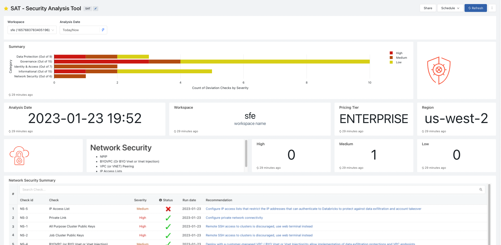
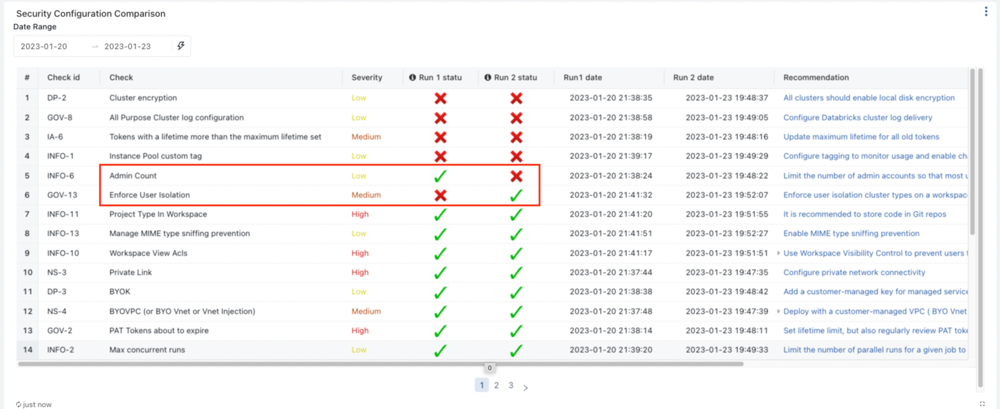

#

# Security Analysis Tool (SAT) 

Refer to specific use-case:
- [Standard setup guide](./docs/setup.md)
- [Terraform](./terraform/README.md)

## Introduction

Security Analysis Tool (SAT) analyzes customer's Databricks account and workspace security configurations and provides recommendations that help them follow Databrick's security best practices. When a customer runs SAT, it will compare their workspace configurations against a set of security best practices and delivers a report for their Databricks (AWS, Azure, and GCP) workspaces. These checks identify recommendations to harden Databricks configurations, services, and resources.

Databricks has worked with thousands of customers to securely deploy the Databricks platform, with the appropriate security features that meet their architecture requirements. While many organizations deploy security differently, there are guidelines and features that are commonly used by organizations that need a high level of security. This tool checks for typical security features that are deployed by most high-security organizations, and reviews the largest risks and the risks that customers ask about most often. It will then provide a security configuration reference link to Databricks documentation along with a recommendation. 

Note: SAT is a productivity tool to help verify security configurations against security best practices of Databricks, its not meant to be used as a certification or an attestation of your deployments. SAT project is being regulary updated to improve correctness of checks, add new checks, fix bugs. Please send your feedback and comments to sat@databricks.com or open a git issue.

## Functionality
Security Analysis Tool (SAT) is an observability tool that aims to improve the security hardening of Databricks deployments by making customers aware of deviations from established security best practices by helping customers monitor the security health of Databricks account workspaces easily. There is a need for a master checklist that prioritizes the checks by severity and running this as a routine scan for all the workspaces helps ensure continuous adherence to best practices. This also helps to build confidence to onboard sensitive datasets.

SAT is typically run daily as an automated workflow in the customers account that collects details on various settings via REST APIs. The details of these check results are persisted in Delta tables in customer storage so that trends can be analyzed over time. These results are displayed in a centralized Databricks SQL dashboard and are broadly categorized into five distinct sections for others in the organization to view their respective workspace settings. It also provides links to the latest public documentation on how to configure correctly which helps customers educate on Databricks security in tiny increments feature by feature. Forewarned is Forearmed!. Alerts can be configured on critical checks to provide notifications to concerned stakeholders. It also provides additional details on individual checks that fail so that an admin persona can pinpoint and isolate the issue and remediate it quickly.

## SAT Insights

Data across any of the configured workspaces can be surfaced through a single pane of SQL Dashboard which is the primary consumption layer where all the insights are arranged in well defined categories namely: 
* Network Security
* Identity & Access
* Data Protection 
* Governance  
* Informational 

The data in each section is further categorized by severity namely: High, Medium, Low.

The dashboard is broken into the five sections and each pillar is laid out in a consistent format.

* Workspace Security Summary
    * The high-level summary calls out findings by category, categorized by severity.
* Workspace Stats
    * This section provides when the analysis was run, workspace name, and service details like tier and region.
* Individual Security Category Details
    * A section for each security category that contains:
      * Security section summary details, such as counts of deviations from recommended best practices
      * A table with security finding details for the security category, sorted by severity. The table describes each security violation and provides  links to documentation that help to fix the finding.

*  Informational Section
    * These are less prescriptive in nature but provide data points that can be scrutinized by data personas to verify thresholds are set correctly for their organization.
* Additional Finding Details
    * This section provides additional details that help to pinpoint the source of a security deviation, including the logic used to detect them. For example, the 'cluster policy not used' will provide a list of the cluster workloads where the policy is not applied, avoiding a needle-in-a-haystack situation.
    

## Detection example

Security Analysis Tool (SAT) analyzes 60 best practices, with more on the way. In the example below, the SAT scan highlights one finding that surfaces a potential risk, and one that meets Databricks' best practices. The Deprecated runtime versions check is red indicating that there are runtimes that are deprecated. Workloads on unsupported runtime versions may continue to run, but they receive no Databricks support or fixes. The Remediation column in the screenshot describes the risk and links to the documentation of the Databricks runtime versions that are currently supported. 

On the other hand, the Log delivery check is green, confirming that the workspace follows Databricks security best practices. Run these checks regularly to comprehensively view Databricks account workspace security and ensure continuous improvement.

Customers can use the "Additional Details" section to display information on what configuration setting or control failed a specific best practice rule. For example, the image below showcases additional details on the "Deprecated runtime versions" risk for administrators to investigate. 

In the example below, the customer can know more about the “Log delivery” by inputting “GOV-3”. 

## Security Deviation Trend
This section shows the trend of security best practice deviations over a date range. This helps identify the inflection point where improvements or degradations started to aid the investigation and remediation. For example, the diagram below shows a count of deviations in various categories by run date. The expectation is that over time the height of these bar charts should shrink or, at best, remain the same. If there is a sudden increase, it warrants immediate investigation as it indicates a possible inadvertent human error.

## Security Configuration Comparison
This section gives ability to compare two runs side by side along each of the security dimensions. This drill-down option helps pinpoint the checks that have either been rectified or degraded, so that security folks can address them speedily.
For example, The diagram below shows the individual checks in various categories for each run. The red recatngle in the diagram shows an improvement in “Enforce User Isolation” but degradation in the “Admin Count” best practice. The expectation is that over time the cross marks should chage to tick marks. If it is the opposite, it warrants immediate investigation as it indicates a degradation. An alert also will be triggered incase of detecting detrimental changes to notify via an email. 

## Configuration and Usage instructions
Refer to [Standard setup guide](./docs/setup.md) or [Terraform](./terraform) to setup  

## Project support 

Please note the code in this project is provided for your exploration only, and are not formally supported by Databricks with Service Level Agreements (SLAs). They are provided AS-IS and we do not make any guarantees of any kind. Please do not submit a support ticket relating to any issues arising from the use of these projects. The source in this project is provided subject to the Databricks [License](./LICENSE). All included or referenced third party libraries are subject to the licenses set forth below.

Any issues discovered through the use of this project should be filed as GitHub Issues on the Repo. They will be reviewed as time permits, but there are no formal SLAs for support. 
