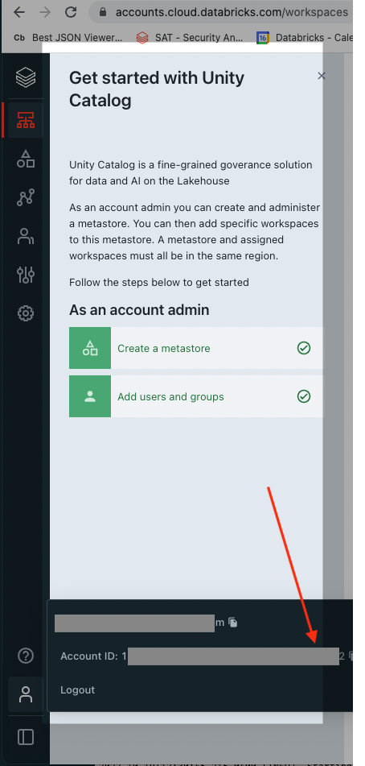
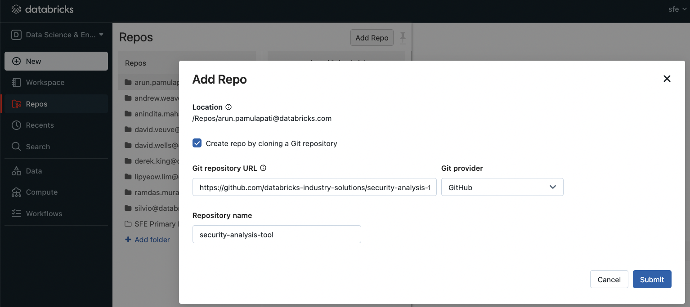
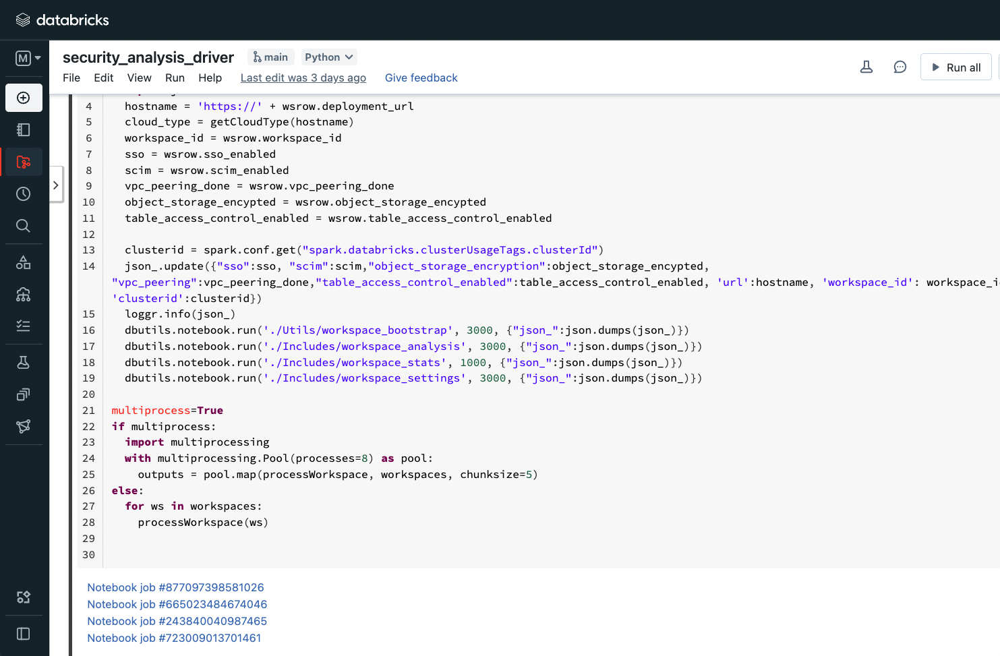
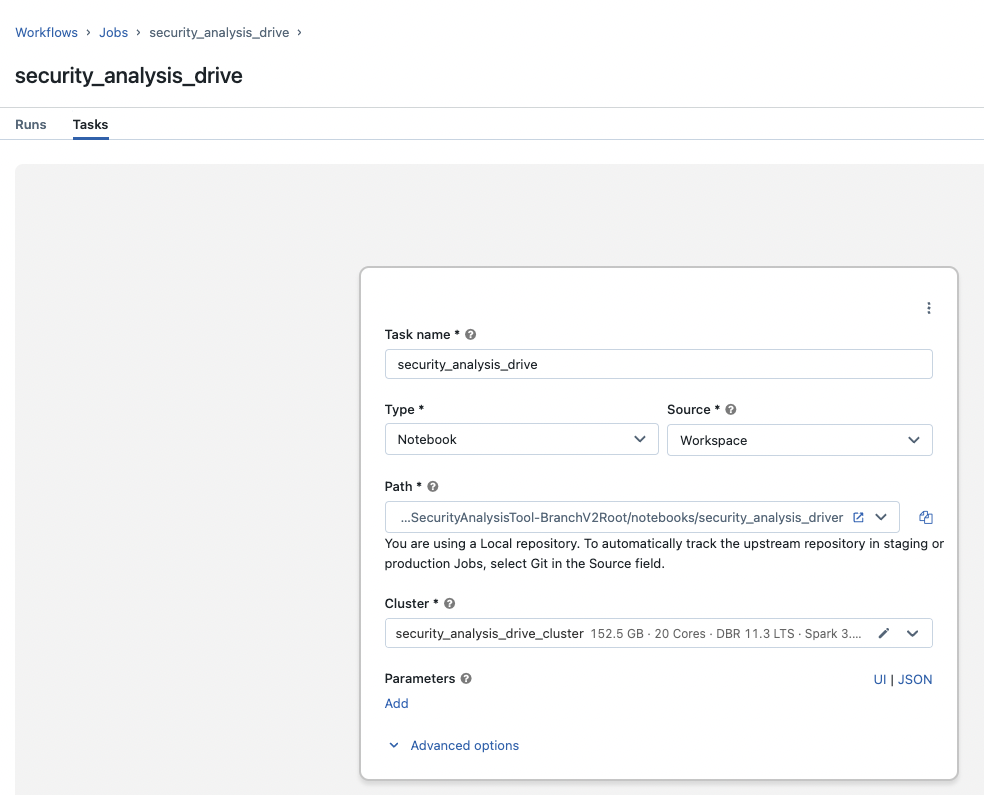

## Checklist to prepare for SAT setup

Please have the following information ready before you start the setup process:

* Databricks account admin and password 
* Workspace PAT tokens for each workspace
* Databricks Account ID
* Databricks SQL Warehouse ID
* Pipy access form your workspace
* Databricks Repos for git


## Prerequisites 

Please gather the following information before you start setting up: 
* Admin access to Databricks account and workspace 
    * Please test your administrator account and password to make sure this is a working account: (https://accounts.cloud.databricks.com/login)[https://accounts.cloud.databricks.com/login]
    * Copy the account id as shown below
       
       
* A Single user cluster with DBR 11.2 LTS or above 
* Requires Databricks SQL for reports and dashboards
   * Goto SQL (pane) -> SQL Warehouse -> and pick the SQL Warehouse for your dashboard and note down the ID as shown below
       
       
*  Please confirm PyPI access is available
*  Make sure you are using repos


## Configuration

* Download and setup Databricks CLI by following the instructions [here](https://docs.databricks.com/dev-tools/cli/index.html)  
* Note: if you have multiple databricks profiles you will need to use --profile <profile name> switch to access correct workspace, 
  follow the instructions [here](https://docs.databricks.com/dev-tools/cli/index.html#connection-profiles)
* Setup authentication to your Databricks workspace by following the instructions [here](https://docs.databricks.com/dev-tools/cli/index.html#set-up-authentication)

  ```
   databricks configure --token --profile <optional-profile-name>
   ```
  
  
  
You should see a listing of folders in your workspace : 
 
 
 
*  Set up the secret scope by following the instructions [here](https://docs.databricks.com/dev-tools/cli/secrets-cli.html)  with the scope name you prefer and note it down:

  ```
   databricks --profile <optional-profile-name> secrets create-scope --scope sat_master_scope
   ```

*  Create username secret and password secret as  "user" and "pass" under the above "sat_master_scope" scope using Databricks Secrets CLI 

    *  Create secret for master account username
   ```
   databricks --profile <optional-profile-name> secrets put --scope sat_master_scope --key user
   ```
      
    *  Create secret for master account password

   ```
   databricks --profile <optional-profile-name> secrets put --scope sat_master_scope --key pass
   ```    

   
      
  Note: The values you place above are case sensitive
 * Import git repo into Databricks repo 
 
 
 * Open the \<SATProject\>/notebooks/Utils/initialize notebook and modify the JSON string with :  
   * Set the value for the account id 
   * Set the value for the sql_warehouse_id
   * databricks secrets scope/key names to pick the secrets from the steps above.
  
* Your config in  \<SATProject\>/notebooks/Utils/initializ CMD 3 should look like this:
        
         ```
            {
               "account_id":"aaaaaaaa-bbbb-cccc-dddd-eeeeeeeeeeee",  <- update this value
               "verbosity":"info",
               "master_name_scope":"sat_master_scope", <- Make sure this matches the secrets scope
               "sql_warehouse_id":"4d9fef7de2b9995c",     <- update this value
               "dashboard_id":"317f4809-8d9d-4956-a79a-6eee51412217",
               "dashboard_folder":"../../dashboards/",
               "dashboard_tag":"SAT",
               "master_name_key":"user",  
               "master_pwd_scope":"sat_master_scope",  
               "master_pwd_key":"pass",
               "workspace_pat_scope":"sat_master_scope",
               "workspace_pat_token_prefix":"sat_token"
            }
         ```

## Setup
Please go to the following folder and attach each notebook to DBR 11.2 cluster and run as per the following instructions :	
 
                                                          
* List account workspaces to analyze with SAT
  * Goto  \<SATProject\>/notebooks/Setup/1.list_account_workspaces_to_conf_file and Run -> Run all 
  * This creates configuration files as noted at the bottom of the notebook.
  * Goto  \<SATProject\>/configs/workspace_configs.csv and update the file for each workspace listed as a new line. 
  * Note: no  “+” character in the alert_subscriber_user_id values due to a limitation with the alerts API. 
                                                          
       
* Generate secrets setup file
  * Run the \<SATProject\>/notebooks/Setup/2.generate_secrets_setup_file notebook.  Setup your PAT tokens for each of the workspaces under the "master_name_scope” 
   
   We generated a template file: \<SATProject\>/configs/setupsecrets.sh to make this easy for you with 
   [curl](https://docs.databricks.com/dev-tools/api/latest/authentication.html#store-tokens-in-a-netrc-file-and-use-them-in-curl), 
   copy paste and run the commands from the file with your PAT token values. 
   You will need to [setup .netrc file](https://docs.databricks.com/dev-tools/api/latest/authentication.html#store-tokens-in-a-netrc-file-and-use-them-in-curl) to use this method
   
  Example:

   curl --netrc --request POST 'https://oregon.cloud.databricks.com/api/2.0/secrets/put' -d '{"scope":"
sat_master_scope", "key":"sat_token_1657683783405197", "string_value":"<dapi...>"}' 
   
   
* Test Connections    
  * Test connections from your workspace to accounts API calls and all workspace API calls by running \<SATProject\>/notebooks/Setup/3. test_connections. It's important that all connections are successful before you can move to the next step.  

* Enable workspaces for SAT 
  * Enable workspaces by running \<SATProject\>/notebooks/Setup/4. enable_workspaces_for_sat.  This makes the registered workspaces ready for SAT to monitor 

* Import SAT dashboard template
  * We built a ready to go DBSQL dashboard for SAT. Import the dashboard by running \<SATProject\>/notebooks/Setup/5. import_dashboard_template
Configure Alerts  (Optional)
SAT can deliver alerts via email via Databricks SQL Alerts. Import the alerts template by running \<SATProject\>/notebooks/Setup/6. configure_alerts_template (optional)
   
## Usage
* Attach to DBR 11.2 cluster and run the \<SATProject\>/notebooks/security_analysis_driver notebook

* Access SAT - Security Analysis Tool dashboard under Databricks SQL Dashboards section to see the report
Note: You may need to run the individual queries cached behind the report the first time. Look for queries tagged “SAT” and run them and then refresh your dashboard. 
   
 * (Optional ) Activate Alerts - Goto Alerts and find the alert created by SAT tag and unmute it and run the query behind the alert to activate it. Set the alert schedule to your needs. 
   
       
       
   
## Configure Workflow (Optional) 
Databricks Workflows is the fully-managed orchestration service. You can configure SAT to automate when and how you would like to schedule it by using by taking advanate of Workflows. 
   
Goto Workflows - > click on create jobs -> setu as following:

Task Name  : security_analysis_drive
   
Type: Notebook
   
Source: Workspace (or your git clone of SAT)
   
Path : \<SATProject\>/SAT/SecurityAnalysisTool-BranchV2Root/notebooks/security_analysis_driver
   
Cluster: Make sure to pick a Single user mode job compute cluster. 
    
   
   
Add schedule as per your needs. That’s it. Now you are continuously monitoring health of your account workspaces.
   
   
## Troubleshooting
   
* Incorrectly configured secrets
Error:
   
Secret does not exist with scope: sat_master_scope and key: sat_tokens
 
Resolution:
Check if the tokens are configured with correct names by listing and comparing with the configuration.
databricks secrets list --scope sat_master_scope

* Invalid access token
   
Error:
   
Error 403 Invalid access token.

Resolution: 
   
Check your PAT token configuration for  “workspace_pat_token” key 

* Firewall blocking databricks accounts console

Error: 
<p/>   
Traceback (most recent call last): File "/databricks/python/lib/python3.8/site-packages/urllib3/connectionpool.py", line 670, in urlopen  httplib_response = self._make_request(  File "/databricks/python/lib/python3.8/site-packages/urllib3/connectionpool.py", line 381, in _make_request  self._validate_conn(conn)  File "/databricks/python/lib/python3.8/site-packages/urllib3/connectionpool.py", line 978, in _validate_conn  conn.connect()  File "/databricks/python/lib/python3.8/site-packages/urllib3/connection.py", line 362, in connect  self.sock = ssl_wrap_socket(  File "/databricks/python/lib/python3.8/site-packages/urllib3/util/ssl_.py", line 386, in ssl_wrap_socket  return context.wrap_socket(sock, server_hostname=server_hostname)  File "/usr/lib/python3.8/ssl.py", line 500, in wrap_socket  return self.sslsocket_class._create(  File "/usr/lib/python3.8/ssl.py", line 1040, in _create  self.do_handshake()  File "/usr/lib/python3.8/ssl.py", line 1309, in do_handshake  self._sslobj.do_handshake() ConnectionResetError: [Errno 104] Connection reset by peer During handling of the above exception, another exception occurred:

 <p/> 
Resolution: 
   
Run this following command in your notebook %sh 
curl -X GET -H "Authorization: Basic <base64 of userid:password>" -H "Content-Type: application/json" https://accounts.cloud.databricks.com/api/2.0/accounts/<account_id>/workspaces
 
If you don’t see a JSON with a clean listing of workspaces you are likely having a firewall issue that is blocking calls to the accounts console.  Please have your infrastructure team add Databricks accounts.cloud.databricks.com to the allow-list.   


                                                          
