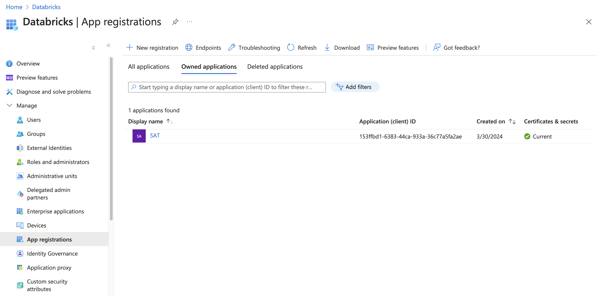
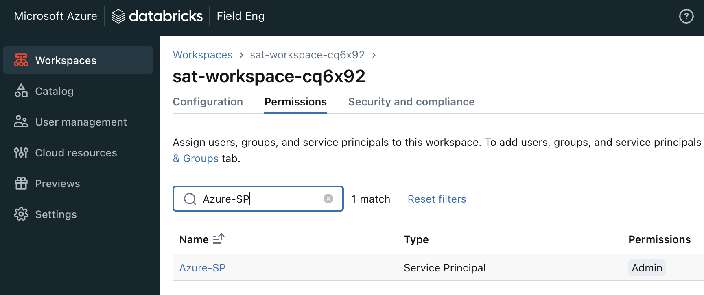
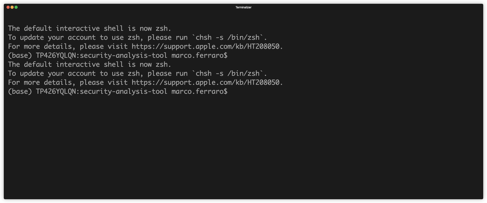

# Azure Setup Guide

This guide will help you setup the Security Analysis Tool (SAT) on Azure Databricks.

- [Azure Setup Guide](#azure-setup-guide)
  - [Prerequisites](#prerequisites)
    - [App Registration](#app-registration)
    - [App Client Secrets](#app-client-secrets)
    - [Add Service Principle to Databricks](#add-service-principle-to-databricks)
  - [Installation](#installation)
    - [Credentials Needed](#credentials-needed)
  - [Troubleshooting](#troubleshooting)
  - [References](#references)

## Prerequisites

There are some pre-requisites that need to be met before you can setup SAT on Azure. Make sure you have the appropriate permissions in your Azure cloud account to create the resources mentioned below.

> SAT is beneficial to customers on **Databrics Premium or Enterprise** as most of the checks and recommendations involve security features available in tiers higher than the Standard.

### App Registration

The first step is to create an App Registration in Azure. This will allow SAT to authenticate with Azure services. Follow the steps below to create an App Registration:

* Open the Azure portal and navigate to Microsoft Entra ID.
* Click on `App registrations` and then click on `New registration`.
* Enter a name for the App Registration and select the appropriate permissions. The minimum requirement is to have access in a single tenant.

### App Client Secrets

After creating the App Registration, you will need to create a client secret. This secret will be used to authenticate with Azure services. Follow the steps below to create a client secret:

* Open the App Registration you created in the previous step.
* Click on `Certificates & secrets` and then click on `New client secret`.
* Enter a description for the client secret and select the expiry date. Click on `Add`.
* Copy the value of the client secret and save it in a secure location.

### Add Service Principle to Databricks

After creating the App Registration and client secret, you will need to add the App Registration as a service principal in Databricks. Follow the steps below to add the service principal:

* As an Account Admin, navigate to the Databricks account console.
* Select the User Management tab and click on the Service Principals tab.
* Click Add Service Principal.
* Paste the App Client ID and App Client Secret in the respective fields.
* Click Add.

See the [Databricks documentation](https://learn.microsoft.com/en-us/azure/databricks/admin/users-groups/service-principals#--databricks-and-microsoft-entra-id-formerly-azure-active-directory-service-principals) for more information on adding service principals.

> The Service Principle requires an [Accounts Admin role](https://learn.microsoft.com/en-us/azure/databricks/admin/users-groups/service-principals#--assign-account-admin-roles-to-a-service-principal), [Admin role](https://learn.microsoft.com/en-us/azure/databricks/admin/users-groups/service-principals#assign-a-service-principal-to-a-workspace-using-the-account-console) for **each workspace** and needs to be a member of the [metastore admin group](https://learn.microsoft.com/en-us/azure/databricks/data-governance/unity-catalog/manage-privileges/admin-privileges#who-has-metastore-admin-privileges) is required to analyze many of the APIs.

## Installation

### Credentials Needed

To setup SAT on Azure, you will need the following credentials:
* Databricks Account ID
* Azure Tenant ID
* Azure Subscription ID
* Azure App Client ID (Obtained from App Registration)
* Azure App Client Secret (Obtained from App Client Secrets)

To execute SAT follow this steps:
- Clone the SAT repository
- Run the `install.sh` script on your terminal.

> Remember the target workspace should have a [profile](https://learn.microsoft.com/en-us/azure/databricks/dev-tools/cli/profiles) in [Databricks CLI](https://learn.microsoft.com/en-us/azure/databricks/dev-tools/cli/)

## Troubleshooting
Please review the FAQs and Troubleshooting resources documented [here](./faqs_and_troubleshooting.md) including a notebook to help diagnose your SAT setup.
If any issues arise during the installation process, please check your credentials and ensure that you have the appropriate permissions in your Azure cloud account. If you are still facing issues, please send your feedback and comments to sat@databricks.com. 

## References

* [Azure App Registration](https://docs.microsoft.com/en-us/azure/active-directory/develop/quickstart-register-app)
* [Databricks Service Principals](https://learn.microsoft.com/en-us/azure/databricks/admin/users-groups/service-principals#--databricks-and-microsoft-entra-id-formerly-azure-active-directory-service-principals)
